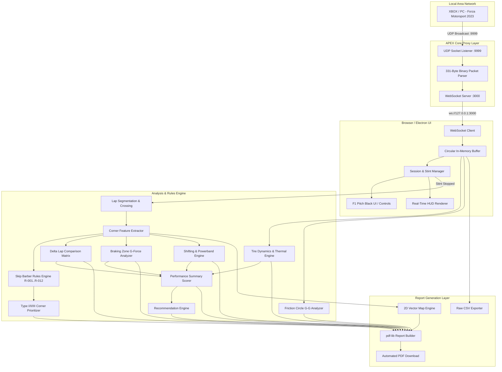

# APEX: Racing Telemetry Analysis Tool
# Comprehensive Development Roadmap & Execution Plan

---

## 1. Executive Summary & Vision

**APEX** is a high-performance, self-hosted, minimalist web and desktop application designed to ingest and analyze UDP telemetry from **Forza Motorsport 2023 (XBOX / PC)**. Rooted in the championship-proven racecraft curriculum of *"Going Faster! Mastering the Art of Race Driving"* by Carl Lopez and the Skip Barber Racing School, APEX delivers automated, data-driven coaching via instant, professional PDF reports with zero external dependencies, no cloud subscriptions, and 100% local privacy.

### Key Architectural & Design Pillars
- **Real-Time UDP Ingestion**: 331-byte binary packet parsing at 60Hz+ with a Node.js/Electron UDP-to-WebSocket bridge.
- **Physics & Racecraft Engine**: Deterministic corner detection, lap segmentation, trail-braking overlap metrics, Throttle Application Point (TAP) distance delta, and Skip Barber heuristic rules.
- **Client-Side PDF Engine**: Vector track map generation, speed profile charts, G-force tables, and tiered coaching recommendations compiled in `< 10s` via `pdf-lib`.
- **F1 Pit-Wall Aesthetic**: OLED pitch black (`#000000`), F1 Red (`#E10600`) dynamic glows, sharp 45° precision corner cuts (`clip-path`), Inter / JetBrains Mono typography, and responsive controls.

---

## 2. Release Milestones & Phase Architecture

```mermaid
gantt
    title APEX Development Roadmap Timeline
    dateFormat  YYYY-MM-DD
    section Phase 1: MVP Core (v1.0.0) ✅
    Sprint 1: UDP Pipeline & Parser        :done, p1_s1, 2026-08-01, 7d
    Sprint 2: UI Foundation & Design System :done, p1_s2, after p1_s1, 7d
    Sprint 3: Lap Segmentation & Algorithms :done, p1_s3, after p1_s2, 7d
    Sprint 4: PDF Generator & Integration   :done, p1_s4, after p1_s3, 7d
    section Phase 2: Enhanced Analysis (v1.1.0) ✅
    Sprint 5: Track Map & Geometry Line     :done, p2_s5, after p1_s4, 7d
    Sprint 6: Trail-Braking & Apex Timing   :done, p2_s6, after p2_s5, 7d
    Sprint 7: Tire Dynamics & Persistence   :done, p2_s7, after p2_s6, 7d
    section Phase 3: Advanced Telemetry (v1.2.0) ✅
    Sprint 8: Best vs Avg Lap Comparison    :done, p3_s8, after p2_s7, 7d
    Sprint 9: Braking Zones & G-Forces      :done, p3_s9, after p3_s8, 7d
    Sprint 10: Shifting & Telemetry Export  :done, p3_s10, after p3_s9, 7d
    section Phase 3.5: Visualization & Scoring (v1.3.0) 🔄
    Sprint 10.5: Friction Circle & Perf Score UI/PDF :active, p35_s105, 2026-08-23, 7d
    section Phase 4: Standalone & Multi-Session (v2.0.0)
    Sprint 11: Electron Packaging & CI/CD   :p4_s11, 2026-08-30, 7d
    Sprint 12: Session Archive & Multi-Stint :p4_s12, after p4_s11, 7d
    Sprint 13: PDF v2.0 Overhaul & Release  :p4_s13, after p4_s12, 7d
```

---

## 3. Detailed Work Breakdown Structure (WBS)

### Phase 1: Core Foundation & MVP (v1.0.0) ✅ COMPLETE
*Completed | Goal: End-to-end working pipeline from XBOX UDP packet to automated PDF report.*

#### Sprint 1: Network Ingestion & Telemetry Parser
- [x] **Task 1.1: UDP Socket Listener (`udp-proxy.js`)**
  - Implement Node.js `dgram` socket binding to `0.0.0.0:9999` (configurable).
  - Handle buffer allocation, socket errors (`EADDRINUSE`), and port collision recovery.
  - Implement base64 / ArrayBuffer framing for transmission over WebSocket.
- [x] **Task 1.2: Local WebSocket Server**
  - Establish `ws` WebSocket broadcast server on `ws://127.0.0.1:8080`.
  - Implement client connection lifecycle, heartbeat keep-alive, and auto-reconnection.
- [x] **Task 1.3: Binary Telemetry Parser**
  - Decode exact 331-byte binary packet payload per FM23 specification using JavaScript `DataView` (Little-Endian).
  - Extract Sled data: `TimestampMS`, `IsRaceOn`, `EngineMaxRpm`, `EngineIdleRpm`, `CurrentEngineRpm`, `AccelerationX/Y/Z`, `VelocityX/Y/Z`, `Yaw/Pitch/Roll`, `TireSlipRatio*`, `TireSlipAngle*`.
  - Extract Dash data: `PositionX/Y/Z`, `Speed` (converted to mph/kmh), `Power`, `Torque`, `TireTemp*`, `Fuel`, `LapNumber`, `RacePosition`, `Accel`, `Brake`, `Clutch`, `Gear`, `Steer`.
- [x] **Task 1.4: In-Memory Ring Buffer**
  - Construct fixed-size `CircularBuffer` (`maxSize = 100,000` samples) to prevent browser memory leaks (<500MB).

#### Sprint 2: Design System & UI Implementation
- [x] **Task 2.1: Design Tokens & CSS Architecture (`index.css`)**
  - Implement full color palette: OLED Black (`#000000`), Dark Gray (`#1A1A1A`), Mid Gray (`#2A2A2A`), F1 Red (`#E10600`), Success Green (`#00CC66`), Error Red (`#FF3333`).
  - Configure typography tokens: `Inter` (UI) and `JetBrains Mono` (Telemetry tabular numbers).
  - Implement 45° angle corner cuts using CSS `clip-path: polygon(...)` across primary buttons, status panels, and inputs.
- [x] **Task 2.2: Live Telemetry Status & Control Panels**
  - Build `StatusIndicator` with animated pulse states (Green Connected, Yellow Connecting, Red Disconnected).
  - Build `ControlsPanel` featuring Start Recording (`⏺`), Stop Recording (`■`), Lap Counter, Stint Timer, and Best Lap display.
  - Implement Settings Panel with UDP Port and Session Name inputs with localStorage persistence.
- [x] **Task 2.3: Responsive Layout & Micro-interactions**
  - Implement desktop, tablet, and mobile breakpoints (1280px, 1024px, 768px).
  - Add active/hover transitions (scale 1.02, glowing borders, red separator gradients).

#### Sprint 3: Lap Segmentation & Going Faster! Algorithms
- [x] **Task 3.1: Lap Segmentation Engine**
  - Implement start/finish line crossing detection using `PositionX/Z` delta checks and `LapNumber` state transitions.
  - Automatically filter and discard out-laps / incomplete in-laps.
  - Calculate accurate lap times, average speed, and top speed metrics.
- [x] **Task 3.2: Deterministic Corner Detection**
  - Implement speed minima detection with multi-point smoothing.
  - Validate corners using steering threshold (> 5°) and lateral G-force (> 0.3G).
  - Classify corner types (Left, Right, Hairpin) and merge duplicate apex detections within 100 samples.
- [x] **Task 3.3: Corner Dynamics Feature Extraction**
  - Calculate Brake Point, Turn-in Point, Apex (minimum speed point), Track-Out Point, and Throttle Application Point (TAP).
  - Compute entry speed, apex speed, exit speed, gear used, min RPM, and exit RPM.
- [x] **Task 3.4: Core Rules Engine (Exit Speed & Braking)**
  - Implement rule evaluations:
    - `R-001`: Late Throttle Application (TAP > Apex + 15ft).
    - `R-002`: Premature Throttle Application (TAP < Apex - 15ft).
    - `R-009`: Under-braking / Early braking (Low entry speed).
    - `R-010`: Over-speed corner entry.

#### Sprint 4: Client-Side PDF Generation & MVP Polish
- [x] **Task 4.1: PDF Layout Architecture (`pdf-lib`)**
  - Setup A4 page canvas (595x842pt) with standard margins and Dark Gray/F1 Red header.
  - Build Header component with session metadata, car ID, track info, date, and lap counts.
- [x] **Task 4.2: Executive Summary & Corner Tables**
  - Section 1: Executive summary grid (Best Lap, Avg Lap, Top Speed, Max Lateral G, Key Insights).
  - Section 2: Corner-by-Corner analysis table with delta comparisons and severity-coded warnings.
- [x] **Task 4.3: Skip Barber Narrative Feedback & Quotes**
  - Integrate contextual "Going Faster!" coaching recommendations and authentic quotes per detected corner fault.
- [x] **Task 4.4: Auto-Download & Stint Workflow**
  - Trigger instant PDF compilation and browser auto-download upon clicking "Stop Recording".
  - Perform end-to-end integration validation with live / simulated FM23 packet streams.

---

### Phase 2: Enhanced Analysis & Visualizations (v1.1.0) ✅ COMPLETE
*Completed | Goal: Vector track maps, trail-braking telemetry, apex geometry, and tire slip.*

```
Phase 2 Delivery Scope:
├── Section 3: The Line (Track Map Visualization)
├── Trail-Braking Overlap & Snap-Off Detection
├── Early Apex & Late Apex Geometry Detection
└── Tire Slip & Temperature Heatmaps
```

#### Sprint 5: Vector Track Map & Line Analysis
- [x] **Task 5.1: 2D Track Map Coordinate Normalization**
  - Transform `PositionX` and `PositionZ` telemetry into normalized SVG/PDF vector paths.
  - Scale aspect ratio dynamically to fit 500x400pt PDF bounding box.
- [x] **Task 5.2: Multi-Color Path Encoding**
  - Color-code track path segments: Green (Full Throttle > 80%), Yellow (Partial Throttle), Red (Braking > 10%), Blue (Coasting).
- [x] **Task 5.3: Track Annotation Overlays**
  - Annotate numbered turn markers (T1, T2, ... Tn) and highlight problem zones directly on the map.

#### Sprint 6: Trail-Braking & Apex Geometry Engine
- [x] **Task 6.1: Trail-Braking Overlap Calculation**
  - Calculate percentage overlap of brake pressure (> 10%) during steering phase (Turn-In to Apex).
  - Implement `R-005`: Little to no trail-braking (< 20% overlap).
- [x] **Task 6.2: Brake Snap-Off Detection**
  - Detect abrupt brake release rate (`dBrake/dt`) at turn-in inducing Trailing Throttle Oversteer (TTO).
- [x] **Task 6.3: Geometric Apex Fault Identification**
  - Detect Early Apex (`R-003`): Steering angle increase/correction > 5° post-apex.
  - Detect Late Apex (`R-004`): Premature steering unwind with excess unused track margin.

#### Sprint 7: Tire Dynamics & State Management
- [x] **Task 7.1: Tire Slip Ratio & Grip Analysis**
  - Calculate longitudinal and lateral slip ratios across all four wheels (`TireSlipRatioFL/FR/RL/RR`).
  - Implement `R-009`: Excessive wheelspin on exit (`slipRatio > 1.0`).
- [x] **Task 7.2: Tire Temperature Assessment**
  - Ingest 4-corner tire temperatures (`tempFL/FR/RL/RR`) and flag cold (< 200°F) or overheated (> 240°F) tires.
- [x] **Task 7.3: PDF Section 7 (Tire Management)**
  - Add dedicated PDF table visualizing 4-tire slip matrix and average operating temperatures.

---

### Phase 3: Advanced Telemetry & Comparative Analytics (v1.2.0) ✅ COMPLETE
*Completed | Goal: Delta comparisons against best lap, threshold braking analysis, shifting powerband.*

#### Sprint 8: Delta Lap Comparison Matrix
- [x] **Task 8.1: Best Lap vs. Average Lap Baseline**
  - Isolate stint's optimal lap and compute delta traces for speed, throttle, and brake across every segment.
- [x] **Task 8.2: Segment-by-Segment Time Loss Attribution**
  - Quantify exact time lost (in tenths of a second) in braking zone, mid-corner, and corner exit.
- [x] **Task 8.3: Type I/II/III Corner Priority Ranking**
  - Implement Skip Barber corner categorization:
    - *Type I*: Leading onto straights (Highest priority).
    - *Type II*: End of straights (Medium priority).
    - *Type III*: Connecting corners (Lowest priority).
  - Rank recommendations by projected lap time gain.

#### Sprint 9: Braking Zone G-Force Deep-Dive
- [x] **Task 9.1: Threshold Braking Efficiency Calculation**
  - Measure peak longitudinal deceleration Gs (`AccelerationZ`) vs car's theoretical maximum.
  - Calculate braking distance (ft / m) from initial brake application to turn-in.
- [x] **Task 9.2: "The Procedure" Braking Evaluation**
  - Evaluate driver's consistency in stepping brake markers closer to turn-in over successive laps.
- [x] **Task 9.3: PDF Section 5 (Braking & Entering)**
  - Render deceleration G profile curves and threshold compliance ratings in the PDF report.

#### Sprint 10: Shifting, Powerband & Data Export
- [x] **Task 10.1: Powerband Optimization Engine**
  - Verify minimum corner RPM and exit RPM against engine powerband (`EngineIdleRpm` to `EngineMaxRpm`).
  - Implement `R-007` (Downshift required: Exit RPM < 60% powerband) and `R-008` (Rev limiter strike risk: Exit RPM > 95% redline).
- [x] **Task 10.2: Downshift Quality Assessment**
  - Evaluate throttle blip accuracy and brake pedal modulation stability during heel-and-toe / downshift events.
- [x] **Task 10.3: Raw Telemetry CSV Export**
  - Provide one-click export of complete stint telemetry (Timestamp, Position, Speed, Gs, Inputs, Temps) to CSV for third-party tooling.

---

### Phase 3.5: Visualization & Performance Scoring (v1.3.0) 🔄 IN PROGRESS
*Target: 1 Week (Aug 23 – Aug 30) | Goal: Render Friction Circle G-G diagram and Performance Score in both PDF and browser UI. Analysis engines already built — this phase is pure visualization.*

> **Context**: The `FrictionCircleAnalyzer` and `PerformanceSummaryEngine` / `RecommendationEngine` were implemented ahead of schedule during Phase 3. They produce rich analysis data but have no visual output yet. This phase bridges the gap.

```
Phase 3.5 Delivery Scope:
├── G-G Friction Circle scatter plot in PDF (vector, phase-colored)
├── G-G Friction Circle section in browser UI (canvas/SVG, interactive)
├── Performance Score dashboard card in browser UI (grade + breakdown)
├── Performance Score header polish in PDF report
├── Top-3 Priority Recommendations panel in browser UI
└── Priority Recommendations section in PDF report
```

#### Sprint 10.5: Friction Circle, Performance Score & Recommendations Rendering
- [x] **Task 10.5.1: G-G Friction Circle PDF Section**
  - Render vector scatter plot of lateral G vs longitudinal G using `pdf-lib` drawing primitives.
  - Phase-color data points: Red (Braking), Green (Accelerating), Gold (Brake+Turn), Blue (Accel+Turn), Purple (Cornering), Gray (Straight).
  - Annotate traction circle utilization percentage and peak combined G.
  - Reference boundary circle at session maximum G magnitude.
- [x] **Task 10.5.2: G-G Friction Circle Browser UI Section**
  - Implement interactive canvas or SVG visualization in the analysis report panel.
  - Render phase-colored scatter with hover tooltips showing sample detail (speed, Gs, phase).
  - Display summary stats: traction utilization %, peak lateral G, peak longitudinal G, dominant phase breakdown.
- [x] **Task 10.5.3: Performance Score Dashboard Card (Browser UI)**
  - Build a prominent dashboard card showing overall 0–100 score with letter grade (A+ through F).
  - Render 4-component breakdown bars: Consistency, Line Quality, Braking Score, Exit Speed.
  - Apply grade-based color coding: Green (A/B), Amber (C), Red (D/F).
- [x] **Task 10.5.4: Performance Score PDF Header Polish**
  - Refine the existing `performanceSummary` usage in the PDF header section.
  - Ensure consistent grade rendering with colored badge, score breakdown grid, and session-over-session context.
- [x] **Task 10.5.5: Priority Recommendations Panel (Browser UI)**
  - Display Top-3 actionable coaching recommendations in the analysis report.
  - Each recommendation: corner reference, category icon, coaching quote, and projected time gain.
  - Sort by highest projected lap time improvement.
- [x] **Task 10.5.6: Priority Recommendations PDF Section**
  - Render prioritized coaching recommendations as a dedicated PDF section.
  - Include per-corner coaching narrative, Skip Barber quotes, severity badges, and category grouping.

---

### Phase 4: Standalone Distribution & Multi-Session History (v2.0.0)
*Target: 3 Weeks (Aug 30 – Sep 20) | Goal: Standalone Electron desktop app, multi-session archiving, consultant-grade PDF overhaul.*

#### Sprint 11: Electron Standalone Architecture & Native Packaging
- [ ] **Task 11.1: Electron Main Process Integration (`electron-main.js`)**
  - Integrate UDP listener socket and WebSocket server directly into Electron background process.
  - Implement native window lifecycle, tray minimization, and menu configuration.
- [ ] **Task 11.2: Cross-Platform Build Pipelines**
  - Configure `electron-builder` for automated packaging:
    - Windows: NSIS Installer (`.exe`) + Portable executable.
    - macOS: Universal DMG (`.dmg`).
    - Linux: AppImage / `.deb`.

#### Sprint 12: Multi-Session History & Comparison
- [ ] **Task 12.1: Client-Side IndexedDB Storage**
  - Persist historical session records, lap metrics, and analysis summaries locally with zero cloud dependencies.
- [ ] **Task 12.2: Stint-to-Stint Progression Tracking**
  - Track driver progression over multiple days/weeks (lap time reduction, corner exit speed delta, consistency index).
- [ ] **Task 12.3: Session JSON Interchange**
  - Allow importing and exporting complete session datasets in JSON format.

#### Sprint 13: PDF v2.0 Overhaul & Production Release
- [ ] **Task 13.1: PDF Report v2.0 Overhaul**
  - Polish layout for 8-page consultant-grade printout with all analysis sections integrated.
  - Ensure consistent pagination, visual hierarchy, and section cross-references.
- [ ] **Task 13.2: Production Release & Documentation**
  - Publish `README.md`, `TROUBLESHOOTING.md`, user guides, and release binaries.
  - Tag v2.0.0 release with changelog and migration notes.

---

## 4. Technical Architecture & Dependency Graph



---

## 5. Skip Barber "Going Faster!" Rules Matrix

| Rule ID | Metric / Trigger Condition | Severity | Racecraft Fault | Coaching Recommendation & Action Plan |
|---|---|---|---|---|
| **R-001** | `TAP Distance > Apex + 15ft` | High | Late Throttle Application | *"The biggest gain in lap time comes from corner exit speed."* Squeeze throttle on earlier as you unwind steering towards track-out. |
| **R-002** | `TAP Distance < Apex - 15ft` | Medium | Premature Power Application | *"Getting to throttle too early induces understeer and pushes the car wide."* Modulate speed with trail-braking before committing to power. |
| **R-003** | `Steering > Apex_Steer + 5° (Post-Apex)` | High | Early Apex | *"The primary symptom of early apexing is the need to turn more in the 2nd part of the turn."* Move turn-in point deeper and apex later. |
| **R-004** | `Unused Track Margin > 2ft at Exit` | Medium | Late Apex / Conservative Line | *"Unused track at exit indicates sacrificed entry and apex speed."* Move turn-in earlier to carry higher rolling minimum speed. |
| **R-005** | `Trail-Brake Overlap < 20%` | Medium | Abrupt Turn-In / No Trail-Brake | *"The question is not if you trail-brake, but how."* Carry light brake pressure past turn-in to transfer weight forward and assist rotation. |
| **R-006** | `Brake Release Rate > 80%/100ms` | High | Brake Snap-Off | *"Abrupt brake release causes Trailing Throttle Oversteer (TTO)."* Bleed off brake pedal progressively as steering lock increases. |
| **R-007** | `Exit RPM < 60% Max RPM` | Medium | Gear Selected Too High | *"If the engine bogs at corner exit, gear is too high."* Downshift one additional gear in braking zone to optimize powerband. |
| **R-008** | `Exit RPM > 95% Max RPM` | Medium | Gear Selected Too Low | *"Hitting rev limiter before corner exit kills acceleration."* Upshift earlier or carry a taller gear to avoid rev limiter bog. |
| **R-009** | `Tire Slip Ratio > 1.0` | High | Excessive Wheelspin | *"Wheelspin destroys rear tires and wastes forward drive."* Smooth out initial throttle progression; do not mat the gas on exit. |
| **R-010** | `Peak Decel G < 80% Max Capability` | Medium | Sub-Threshold Braking | *"Practice The Procedure: Step your brake point in small bites to find the limit of deceleration."* Press harder initially in straight line. |
| **R-011** | `Consecutive Lap Exit Speed Var > 3mph` | Medium | Throttle Inconsistency | *"Focus on consistent reference points for throttle application."* Align power application with steering unwinding rate. |
| **R-012** | `Over-Braking Delta > 10mph vs Apex` | High | Parking the Car in Mid-Corner | *"Over-slowing at corner entry forces a coasting dead-zone."* Roll higher minimum speed into the corner. |

---

## 6. Comprehensive Testing & Quality Assurance Plan

### 6.1 Testing Pyramid
```
          / \
         /   \       E2E / Integration Tests (20%)
        / E2E \      - End-to-end synthetic UDP packet stream to PDF validation
       /-------\
      /         \    Module Integration Tests (30%)
     / Integrat. \   - Lap segmentation, Corner detection, Buffer overflow
    /-------------\
   /               \ Unit Tests (50%)
  /   Unit Tests    \ - Binary packet parsing, Going Faster! rules, coordinate math
 /-------------------\
```

### 6.2 Test Suites Breakdown

**Current Status: 14 test files | 52 tests | 52 passing | 0 failing** *(as of v1.2.0)*

| Suite | Test File | Scope | Target Metrics | Status |
|---|---|---|---|---|
| **Binary Parser** | `parser.test.js` | Verify exact byte offset decoding against FM23 UDP specification. Validate endianness, negative values, and NaN handling. | 100% field coverage | ✅ Pass |
| **Circular Buffer** | `buffer.test.js` | Ring buffer overflow, eviction, and capacity limit enforcement. | 0 leaks at 100K samples | ✅ Pass |
| **Corner Detection** | `analysis.test.js` | Speed minima algorithms across circuit types (hairpins, chicanes, sweepers). | ≥ 98% detection accuracy | ✅ Pass |
| **Rules Engine** | (integrated in `analysis.test.js`) | R-001 through R-012 trigger exact severity ratings and calculations. | 100% rule condition coverage | ✅ Pass |
| **Track Map** | `track-map.test.js` | 2D vector coordinate normalization, color encoding, SVG generation. | Correct bounds & annotations | ✅ Pass |
| **Trail-Braking** | `trail-braking.test.js` | Trail-brake overlap %, snap-off detection, R-005/R-006 rules. | Accurate overlap metrics | ✅ Pass |
| **Tire Dynamics** | `tire-dynamics.test.js` | 4-corner slip ratios, thermal status, R-009 wheelspin detection. | All 4 wheels validated | ✅ Pass |
| **Delta Comparison** | `delta-comparison.test.js` | Best vs average lap deltas, Type I/II/III classification, time loss attribution. | Correct segment deltas | ✅ Pass |
| **Braking Zones** | `braking-zones.test.js` | Threshold braking efficiency, "The Procedure" scoring, decel G profiles. | Grade accuracy validated | ✅ Pass |
| **Shifting & Powerband** | `shifting-powerband.test.js` | Powerband optimization, downshift quality, R-007/R-008 rules. | Shift quality grades match | ✅ Pass |
| **Friction Circle** | `friction-circle.test.js` | G-G scatter generation, phase classification, traction utilization %. | Phase colors & utilization | ✅ Pass |
| **Performance Summary** | `performance-summary.test.js` | Overall 0–100 scoring, 4-component breakdown, grade assignment. | Grade boundaries correct | ✅ Pass |
| **CSV Export** | `csv-export.test.js` | Full telemetry CSV formatting, header row, field mapping. | All columns present | ✅ Pass |
| **PDF Generation** | `pdf.test.js` | PDF compilation, layout bounds, section rendering, multi-lap pagination. | < 10s generation, < 2MB | ✅ Pass |
| **E2E Pipeline** | `pipeline.test.js` | End-to-end: raw samples → analysis → PDF output validation. | Full pipeline integrity | ✅ Pass |

### 6.3 Performance Benchmarks

| Metric | Target | Tool |
|---|---|---|
| Heap usage (100+ laps, 2hr continuous) | < 500MB | Chrome DevTools / Node profiler |
| Frame drops during 60Hz ingestion | 0 | Performance Observer |
| WebSocket latency | < 10ms | Network tab / custom instrumentation |
| PDF generation (20 laps) | < 10s | `console.time` benchmark |
| PDF file size (20 laps) | < 2MB | File system validation |

---

## 7. Risk Management & Mitigation Matrix

| Risk Event | Impact | Likelihood | Mitigation Strategy |
|---|---|---|---|
| **UDP Port Collision (Port 9999 in use)** | High | Medium | Implement dynamic port configuration UI with fallback port scanner and clear UI error guidance. |
| **Network Packet Drop over Wi-Fi** | Medium | High | Implement interpolation for single-frame dropouts; add connection quality indicator (packet rate / sec) on UI. |
| **Browser Memory Overflow on 50+ Lap Stints** | High | Low | Enforce strict `CircularBuffer` capacity limit; store compact typed arrays rather than nested object graphs. |
| **PDF Memory Spike on Large Multi-Page Output** | Medium | Medium | Stream page generation sequentially using `pdf-lib` without keeping redundant canvas bitmaps in memory. |
| **Forza Motorsport Telemetry Spec Updates** | Medium | Low | Maintain versioned telemetry parser schema with modular field mapping. |
| **Cross-Platform Electron Portability Issues** | Low | Medium | Utilize standard multi-platform `electron-builder` configuration; isolate OS-specific file paths. |
| **Canvas/SVG Rendering Performance (G-G scatter)** | Medium | Medium | Downsample scatter points to ≤ 2000 for browser rendering; use full dataset only in PDF vector output. |

---

## 8. Release Checklist & Acceptance Criteria

### v1.0.0 (MVP) Launch Criteria ✅
- [x] Connects seamlessly to Forza Motorsport 2023 UDP stream on LAN.
- [x] UI reflects accurate real-time connection state and stint timer.
- [x] Accurately segments laps and identifies corners with > 95% reliability.
- [x] Automatically compiles and downloads clean A4 PDF report in under 10 seconds.
- [x] Follows F1-inspired pitch black design system with 45° cut components.
- [x] Operates 100% locally with zero cloud dependencies, accounts, or trackers.

### v1.1.0 Feature Release Criteria ✅
- [x] PDF includes 2D vector track map with throttle/braking color encoding.
- [x] Trail-braking overlap and snap-off detection fully operational.
- [x] Geometry line analysis detects early and late apexes accurately.
- [x] Settings persist across browser sessions in `localStorage`.

### v1.2.0 Telemetry Release Criteria ✅
- [x] Best lap vs average lap delta tables integrated in PDF.
- [x] Threshold braking G-force and deceleration distances calculated.
- [x] Powerband and shifting optimization rules active.
- [x] Full stint raw data exportable to CSV.

### v1.3.0 Visualization & Scoring Release Criteria ✅
- [x] G-G Friction Circle scatter plot rendered in PDF report with phase-colored data points.
- [x] G-G Friction Circle interactive visualization in browser UI.
- [x] Performance Score dashboard card visible in browser UI with grade + 4-component breakdown.
- [x] Performance Score header polished and consistently rendered in PDF.
- [x] Top-3 Priority Recommendations panel displayed in browser UI.
- [x] Priority Recommendations section rendered in PDF report.

### v3.0.0 "Going Faster!" Racecraft & Dynamics Expansion Criteria ✅
- [x] **Sprint 14: Vehicle Dynamics & CPR Skid Control Engine**: True Yaw vs Slip differential, CPR (Correction-Pause-Recovery) state machine, TTO classifier, Tankslapper / Death Wiggle detection.
- [x] **Sprint 15: 4-Block Corner Entry & Overslowing Diagnostics**: Blocks 1-4 segmentation, squeeze vs slam rate, downshift brake pressure dips, and straightaway time penalty attribution.
- [x] **Sprint 16: Suspension Load Transfer & Chassis Setup Coach**: 4-wheel travel tracking, bottoming-out strike alerts, dynamic aero rake, and prescriptive mechanical adjustments (ARBs, springs, dampers, brake bias).
- [x] **Sprint 17: Dynamic Track Surface & Wet-Weather Intelligence**: Puddle telemetry, single-side water drag alert, hydroplaning risk, rim-shot wet line vs dry line analysis, and camber G-multiplier.
- [x] **Sprint 18: Racecraft Engine & 14-Point Skip Barber Scorecard**: Heel-and-toe downshift rev match quality, upshift speed, draft tow calculator, and official 14-category post-session scorecard in UI & PDF.

### v4.0.0 Desktop Suite Launch Criteria
- [ ] Standalone installer and portable executable available for Windows, macOS, and Linux.
- [ ] Historical session archive powered by local IndexedDB.
- [ ] Session import/export via JSON interchange format.
- [ ] Multi-stint progression tracking across weeks/months.
- [ ] Production documentation: README, troubleshooting guide, and user guide published.

---

*Document Version: 3.0.0 | Last Updated: 2026-08-24 | Status: COMPLETED | Reference Documents: [Going faster.pdf](file:///d:/AI%20Workspace/APEX%20v2.9/Docs/Going%20faster.pdf), [PRD.md](file:///d:/AI%20Workspace/APEX%20v2.9/Docs/APEX%20PRD.md), [TRD.md](file:///d:/AI%20Workspace/APEX%20v2.9/Docs/APEX%20TRD.md)*
