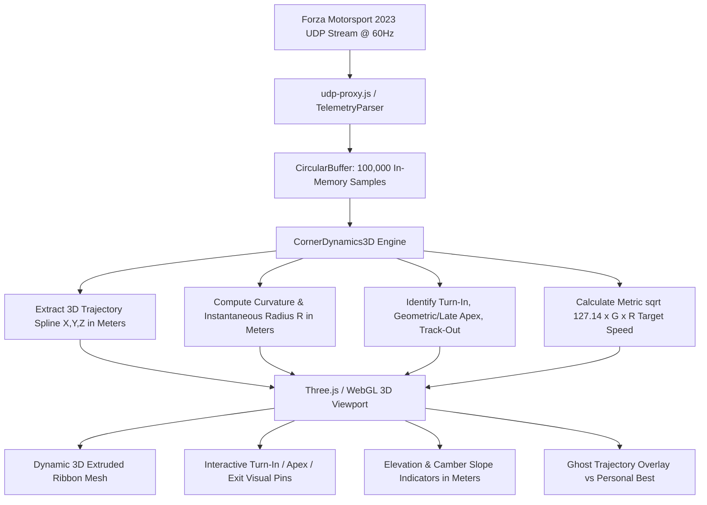

# APEX: Real-Time 3D Track Map & Spatial Racecraft Engine
## Visual Implementation Architecture Grounded in *Going Faster! Chapter 2: The Three Basics* (Metric Standard)

---

## 1. Executive Overview & Physics-First Philosophy

By bridging **Forza Motorsport 2023 60Hz UDP binary telemetry** (`PositionX/Y/Z`, `Yaw/Pitch/Roll`, `Speed`, `Gear`, `Steer`, `Accel`, `Brake`, tire slip vectors) with the core racecraft mechanics established by Carl Lopez and the Skip Barber Racing School in ***Going Faster! Chapter 2 ("The Three Basics: Line, Corner Exit Speed, Braking")***, APEX constructs a real-time, interactive **3D Track Trajectory & Ribbon Map** using the **International Metric Standard (SI)**.

The 3D engine visualizes the foundational physics governing racecars:

$$v\text{ (km/h)} = \sqrt{127.14 \cdot G \cdot R\text{ (m)}} \quad \iff \quad v\text{ (m/s)} = \sqrt{9.81 \cdot G \cdot R\text{ (m)}}$$

Where:
* **$G$**: Car's lateral acceleration limit (lateral grip in $g$'s, extracted from normalized slip angles and accelerometers; $1.0G = 9.81\text{ m/s}^2$).
* **$R$**: Instantaneous turn radius in **meters** ($R = \frac{v^2}{127.14 \cdot G}$ with $v$ in $\text{km/h}$, or $R = \frac{v^2}{9.81 \cdot G}$ with $v$ in $\text{m/s}$).
* **$v$**: Maximum sustainable cornering speed in **$\text{km/h}$** before tire saturation/sliding.

```
                    ┌─────────────────────────────────────────────────────────┐
                    │       GOING FASTER! CHAPTER 2: THE THREE BASICS         │
                    ├────────────────────┬───────────────────┬────────────────┤
                    │   1. THE LINE      │ 2. EXIT SPEED     │  3. BRAKING    │
                    │ (Radius Maximizer) │ (Early Throttle)  │  (Threshold)   │
                    └─────────┬──────────┴─────────┬─────────┴────────┬───────┘
                              │                    │                  │
                              ▼                    ▼                  ▼
                    ┌─────────────────────────────────────────────────────────┐
                    │         APEX REAL-TIME 3D SPATIAL VISUAL ENGINE         │
                    │   • 3D Trajectory Ribbon (Color-Coded Telemetry Mesh)   │
                    │   • Turn-In, Geometric/Late Apex, Track-Out Visual Pins │
                    │   • Real-Time Arc Radius ($R$ in m) & Target km/h / Gear│
                    │   • Dynamic 3D Friction Circle & Trail-Brake Vectors    │
                    └─────────────────────────────────────────────────────────┘
```

---

## 2. Visual Fundamentals from Chapter 2: The Three Basics (Metric Units)

### 2.1 The Three Radii & The Racing Line ($R_1$ vs $R_2$ vs $R_3$)

Chapter 2 demonstrates how utilizing the full track width expands the turn radius, unlocking significantly higher terminal speeds through Turn 7 at Sebring (or any standard 90° corner):

```
TRACK ENTRY (OUTSIDE)                                              TRACK EXIT (OUTSIDE)
=====================┐                                        ┌========================
                     │ \                                    / │
                     │   \       R3: RACING LINE (59.4 m)     │
                     │     \     [86.9 KM/H @ 1.0G]     /     │
                     │       \                        /       │
- - - - - - - - - - -│ - - - - \ - - - - - - - - - -/ - - - - -│ - - - - - - - - - - - - 
                     │          \                 /           │
                     │            \             /             │
                     │  R1: INSIDE  \         /   R2: MIDDLE  │
                     │  ARC (31.4 m)  \     /     ARC (45.7 m)│
                     │  [63.2 KM/H]    \   /      [76.3 KM/H] │
                     │                  \ /                   │
=====================┘                   o APEX               └========================
TRACK ENTRY (INSIDE)               (CLIPPING POINT)                TRACK EXIT (INSIDE)
```

#### Comparative Physics & Speed Matrix (at 1.0G Lateral Load):

| Trajectory Path | Radius ($R$) | Theoretical Speed Limit ($v = \sqrt{127.14 \cdot G \cdot R}$) | Speed Gain vs Inside Arc | Skip Barber Classification |
| :--- | :---: | :---: | :---: | :--- |
| **$R_1$: Inside Arc** | **$31.4\text{ m}$** ($103\text{ ft}$) | **$63.2\text{ km/h}$** ($17.6\text{ m/s}$) | Baseline | *Hugging the inside curb; worst possible line* |
| **$R_2$: Middle Arc** | **$45.7\text{ m}$** ($150\text{ ft}$) | **$76.3\text{ km/h}$** ($21.2\text{ m/s}$) | $+13.1\text{ km/h}$ ($+20.7\%$) | *Center-lane driving; fails to use available width* |
| **$R_3$: Racing Line** | **$59.4\text{ m}$** ($195\text{ ft}$) | **$86.9\text{ km/h}$** ($24.1\text{ m/s}$) | **$+23.7\text{ km/h}$ ($+37.5\%$)** | **Optimal geometric/late apex line using 100% track width** |

---

### 2.2 Visual Comparison: Geometric Apex vs Late Apex vs Early Apex Disaster

Chapter 2 explicitly breaks down the geometry of turn-in points and their catastrophic or beneficial effects on corner exit speed and safety margins:

```
───────────────────────────────────────────────────────────────────────────────────────
A. EARLY APEX (THE FATAL MISTAKE - Page 23)
───────────────────────────────────────────────────────────────────────────────────────
Turn-In: Too Early ──► Car hits apex before corner center ──► Path straightens toward outer curb
                       Exit radius shrinks (R_exit < R_entry) ──► Driver runs out of road or lifts!
   
                      OUTSIDE CURB ───────────────────────────────┐
                      ENTRY                                       │ RUNS OUT OF ROAD!
                      ═════════╗                                  │ (OR FORCED LIFT/OFF-TRACK)
                                ╚══╗                              │ 💥
                                   ╚══╗                          ╔╧═══════
                                      ╚══╗                      ╔╝
                                         ╚═╦════════════════════╝
                                           ▼ EARLY APEX (DANGER)
                                           
───────────────────────────────────────────────────────────────────────────────────────
B. LATE APEX (THE SAFE & FAST EXIT STRATEGY - Page 25)
───────────────────────────────────────────────────────────────────────────────────────
Turn-In: Delayed & Deep ──► Heavy trail-braking past geometric center ──► Late Clipping Point
                            Car is rotated early ──► Straight exit path allows 100% full throttle!
   
                      OUTSIDE CURB ───────────────────────────────┐
                      ENTRY                                       │ WIDE EXIT / FULL THROTTLE
                      ═════════╗                                  │ 🚀 MAXIMUM EXIT SPEED
                               ╚═╗                                │
                                 ╚═╗                              │
                                   ╚═╗                          ╔═╧═══════
                                     ╚═╗                      ╔═╝
                                       ╚═╗   LATE APEX        ║ 
                                         ╚═══════●════════════╝
                                                 ▲ (Safe, Early Throttle)
```

---

## 3. Real-Time 3D Map Visual Architecture & Features (Metric Standard)

```
                                    3D CAMERA ORBIT
                                          ▲
                                          │
    ┌─────────────────────────────────────┴─────────────────────────────────────┐
    │                                                                           │
    │   [TURN-IN MARKER]              [APEX CLIPPING PIN]        [TRACK-OUT PIN]│
    │   🔵 Blue Beacon                 🟡 Gold / 🟢 Green Beacon   🏁 Checkered   │
    │   • Speed: 142 km/h              • Speed: 87 km/h            • Speed: 181km/h│
    │   • Gear: 3rd                    • Distance Delta: +4.3m     • Throttle:100%│
    │   • Braking: 85%                 • Late Apex Confirmed       • Gear: 4th    │
    │                                                                           │
    │          \                              │                              /  │
    │           \                             │                             /   │
    │   ═════════▼════════════════════════════▼════════════════════════════▼══  │
    │   TRAIL-BRAKE ZONE                  APEX MIN SPEED              FULL ACCEL│
    │   [Crimson/Purple Ribbon]         [Bright Yellow Segment]    [Emerald Red]│
    │                                                                           │
    └───────────────────────────────────────────────────────────────────────────┘
```

### Feature 1: Entry Corner Diagnostics (Turn-In Speed, Brake Threshold & Target Gear)

#### Telemetry Channel Ingestion
* `PositionX/Y/Z`: 3D World space trajectory coordinates in meters.
* `Brake` ($0-255$): Detection of initial brake application and threshold plateau.
* `Steer` ($-127 \text{ to } +127$): Steering input angle and angular velocity ($\frac{d\text{Steer}}{dt}$).
* `Speed` (m/s $\rightarrow$ km/h): Longitudinal velocity at the exact point of turn-in.
* `EngineRpm` & `Gear`: Gear selection and rev matching under downshifts.

#### Algorithmic Logic
1. **Braking Point ($P_{brake}$)**: Timestamp/coordinate where `Brake` $> 5\%$.
2. **Turn-In Point ($P_{turn-in}$)**: Timestamp/coordinate where steering deflection $|\text{Steer}| > 3^\circ$ occurs while decelerating.
3. **Threshold Calculation**: Measure braking pressure consistency against the peak tire traction limit ($F_{friction} = \mu \cdot m \cdot g$).
4. **Theoretical Speed Suggestion**: Based on corner entry radius $R_{entry}$ in meters and car grip $G$:

$$V_{target\_entry}\text{ (km/h)} = \sqrt{127.14 \cdot G_{peak} \cdot R_{entry}\text{ (m)}}$$

#### 3D Visual Rendering
* **Marker**: Floating 3D Holographic Beacon with downward laser line to track surface.
* **HUD Tooltip**:
  ```
  ┌── TURN-IN PIN #03 ────────────────────────┐
  │ Target Entry: 142 km/h (Actual: 135 km/h) │
  │ Optimal Gear: 3rd                         │
  │ Threshold Brake: 92% Pressure (Clean)     │
  └───────────────────────────────────────────┘
  ```

---

### Feature 2: Geometric vs Late Apex Real-Time 3D Overlay

#### Telemetry Channel Ingestion
* `PositionX/Z`: 2D planar position in meters relative to inner track boundaries.
* `Yaw` & `YawRate`: Vehicle heading in radians/degrees and rotation rate.
* `Speed`: Identification of absolute local minimum speed ($V_{min}$ in km/h).
* `Accel` & `Brake`: Detection of the transition from trail-braking to initial throttle application (TAP).

#### Algorithmic Logic
1. **Geometric Apex ($P_{geom}$)**: Center point along the inside corner curb geometry equidistant between entry and exit.
2. **Actual Telemetry Apex ($P_{telemetry}$)**: Point of minimum distance to inner boundary ($d_{inner} \to \min$) combined with minimum cornering speed ($V_{min}$).
3. **Apex Delta ($\Delta S_{apex}$)**:

$$\Delta S_{apex} = \text{DistanceAlongTrack}(P_{telemetry}) - \text{DistanceAlongTrack}(P_{geom})$$

* If $\Delta S_{apex} > +3.0\text{ m}$: **Optimal Late Apex** (Exit Speed Prioritized).
* If $|\Delta S_{apex}| \le 3.0\text{ m}$: **Geometric Neutral Apex** (Momentum Corner).
* If $\Delta S_{apex} < -3.0\text{ m}$: **Early Apex Warning** (Immediate coaching trigger for premature turn-in).

#### 3D Visual Rendering
* **Geometric Reference**: Translucent wireframe ring on the inner curb.
* **Actual Driver Apex**: High-intensity glowing 3D beacon (Gold for Late Apex, Crimson for Early Apex).
* **HUD Tooltip**:
  ```
  ┌── APEX ANALYSIS ──────────────────────────┐
  │ Apex Type: LATE APEX (+4.3 m / +14.2 ft)  │
  │ Apex Speed: 87.2 km/h (Ref PB: 88.2 km/h) │
  │ Radius Utilization: 58.2 m (98.0% of R3)  │
  │ Verdict: EXCELLENT EXIT LINE SETUP        │
  └───────────────────────────────────────────┘
  ```

---

### Feature 3: Track-Out Point, Exit Speed & Throttle Application Point (TAP)

#### Telemetry Channel Ingestion
* `PositionX/Y/Z`: Track-out coordinates in meters near outer curb.
* `Accel` ($0-255$): Full throttle ($100\%$) application timestamp.
* `Steer`: Steering angle unwinding toward zero ($|\text{Steer}| \to 0$).
* `Speed`: Terminal exit speed in $\text{km/h}$ reaching the straight.

#### Algorithmic Logic
1. **Throttle Application Point (TAP)**: Point along the arc where the driver first applies positive throttle ($>5\%$) and does not lift.
2. **Track-Out Point ($P_{exit}$)**: Point where vehicle reaches within $0.5\text{ m}$ of outer track boundary with steering angle $< 3^\circ$.
3. **Compound Exit Value**:

$$\Delta V_{straight} = V_{exit\_actual} - V_{exit\_ref}$$

Carrying $+5\text{ km/h}$ off the corner exit produces a persistent cumulative time gain down the entire length of the ensuing straight ($L_{straight}$ in meters):

$$\Delta t_{straight} \approx \frac{L_{straight}}{V_{avg}\text{ (m/s)}} - \frac{L_{straight}}{V_{avg}\text{ (m/s)} + \Delta V_{exit}\text{ (m/s)}}$$

#### 3D Visual Rendering
* **Marker**: Checkered 3D Finish-line Gate with floating speed/gear telemetry badge.
* **HUD Tooltip**:
  ```
  ┌── TRACK-OUT PIN ──────────────────────────┐
  │ Exit Speed: 180.9 km/h (112.4 mph)        │
  │ Full Throttle Point: 5.5 m before Apex    │
  │ Gear at Exit: 4th @ 6,800 RPM             │
  │ Straight Time Delta: -0.18s vs Previous   │
  └───────────────────────────────────────────┘
  ```

---

## 4. 3D Telemetry Ribbon Shader & Color State Palette

The 3D trajectory ribbon dynamically renders the car's state across the entire 3D track profile according to APEX's F1 Pit-Wall design token palette:

```
3D RIBBON GRADIENT PIPELINE:
[Straight: 100% Throttle] ──► [Threshold Braking] ──► [Trail-Braking Blend] ──► [Apex Vmin] ──► [Exit Accel]
       Emerald Green               Bright Crimson          Violet / Purple         Gold/Amber       Emerald Green
         #00FF66                       #E10600                 #9900FF               #FFCC00           #00CC66
```

### Dynamic 3D Vertex Color Mapping Matrix:

| Driving Dynamic Phase | Dominant Telemetry Trigger | Hex Token | Visual 3D Appearance |
| :--- | :--- | :---: | :--- |
| **Straight Full Throttle** | `Accel` $> 90\%$, `Brake` $= 0$, `Steer` $< 3^\circ$ | `#00FF66` | High-speed neon emerald solid ribbon |
| **Straightline Threshold Brake**| `Brake` $> 70\%$, `Steer` $< 5^\circ$ | `#E10600` | Intense F1 Crimson glowing extrusion |
| **Trail-Braking Entry Phase** | `Brake` $> 15\%$ AND `Steer` $> 10^\circ$ | `#9900FF` | Electric Purple/Magenta fading ribbon |
| **Coast / Balance Transition** | `Brake` $< 10\%$, `Accel` $< 20\%$, `Steer` $> 15^\circ$ | `#3399FF` | Sky Blue neutral balance ribbon |
| **Apex Minimum Speed Zone** | $V \le V_{min} + 3\text{ km/h}$, $|\text{Steer}| \to \max$ | `#FFCC00` | Bright Amber/Gold localized pin & halo |
| **Power Exit / Acceleration** | `Accel` $> 40\%$, `Steer` unwinding | `#00CC66` | Vibrant Racing Green widening ribbon |
| **Tire Slip / Traction Limit** | `TireSlipRatio` $> 1.15$ OR Lateral $G > G_{limit}$ | `#FF3300` | Pulsing Red/Orange hazard mesh vertices |

---

## 5. Technical Implementation Architecture



### Module File Structure:
1. **Analysis Core**: [src/analysis/corner-dynamics-3d.js](file:///d:/AI%20Workspace/APEX%20v2.9/src/analysis/corner-dynamics-3d.js) (and browser mirror in [public/js/analysis/corner-dynamics-3d.js](file:///d:/AI%20Workspace/APEX%20v2.9/public/js/analysis/corner-dynamics-3d.js)).
2. **Client 3D Renderer**: `public/js/components/track-map-3d.js` utilizing Three.js / WebGL lightweight canvas context.
3. **HUD Controller Integration**: [public/js/hud.js](file:///d:/AI%20Workspace/APEX%20v2.9/public/js/hud.js) with keyboard toggle (`3` or `M`) to switch between 2D Top-Down Vector Map and 3D Isometric Orbit Map.

---

## 6. Summary: Coaching Deliverable

By embedding the exact geometric diagrams, metric radius physics ($v = \sqrt{127.14 \cdot G \cdot R}$ with $R$ in meters and $v$ in $\text{km/h}$), and late apex principles of Chapter 2 into the 3D real-time visualizer, APEX transforms raw telemetry into an intuitive, visual driving instructor that coaches the driver at 60 frames per second in SI metric units.