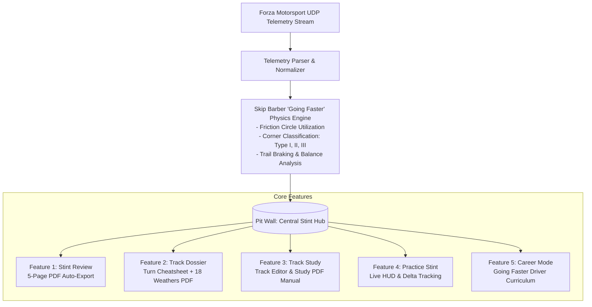

# Project Plan: APEX v3.0 - Unified Telemetry Hub & Modular Print Engine

**Slug:** `apex-v3-telemetry-hub`  
**Target:** APEX v3.0 Architecture & Feature Implementation  
**Project Type:** WEB / DESKTOP (Electron + Node.js + Vanilla JS UI)  
**Primary Agent:** `project-planner` / `orchestrator`  
**Reference Document:** Skip Barber Racing School *Going Faster! Mastering the Art of Race Driving*  

---

## 1. Overview & System Context

APEX v3.0 establishes a unified, telemetry-first architecture for Forza Motorsport 2023 data analysis. At the core is the **Pit Wall**, which records and stores all session stints. All analytical tools, automated PDF export pipelines, and the new **Going Faster Career Mode** connect directly to the Pit Wall as the single source of truth.



---

## 2. Success Criteria

1. **Pit Wall Stint Hub**: Telemetry data from UDP is packaged into standardized Stint objects with full lap-by-lap metadata, sector breakdowns, and telemetry traces.
2. **Going Faster Analytics Engine**:
   - Computes G-G / Friction Circle efficiency (% of vehicle grip limit utilized).
   - Classifies corners into Type I (critical exit onto straight), Type II (critical entry/braking at end of straight), and Type III (connecting complex).
   - Measures Trail-Braking efficiency (braking decay slope vs. steering angle).
3. **Feature 1 (Stint Review 5-Page PDF Auto-Export)**:
   - Page 1: Stint Overview & Consistency Breakdown.
   - Page 2: Friction Circle & Lateral/Longitudinal G-G Car Balance.
   - Page 3: Corner-by-Corner Speed, Throttle & Brake Profiles.
   - Page 4: Tire Thermal Dynamics & Suspension Stroke.
   - Page 5: Skip Barber Coaching Summary & Improvement Action Plan.
   - Triggers automatically upon stint save in Pit Wall.
4. **Feature 2 (Track Dossier Auto-Export)**:
   - Turn-by-turn cheatsheet with braking markers, apex points, and gear advice.
   - 18-Weather matrix detailing grip coefficients, tire pressure offsets, and wet lines.
5. **Feature 3 (Track Study Manual Export)**:
   - Track Editor custom PDF + Comprehensive Track Study PDF on demand.
6. **Feature 4 (Practice Stint)**:
   - Real-time session monitoring with zero regressions to current live telemetry view.
7. **Feature 5 (Career Mode)**:
   - 5-Tier Driver Progression based directly on the *Going Faster* curriculum:
     - Tier 1: Car Control & Traction Circle Fundamentals
     - Tier 2: Corner Typology & Line Selection (Type I/II/III)
     - Tier 3: Trail Braking & Weight Transfer Dynamics
     - Tier 4: Dynamic & Wet Weather Mastery (18 Conditions)
     - Tier 5: Racecraft & Telemetry Mastery

---

## 3. Tech Stack & Architecture Design

| Layer | Technologies | Rationale |
|---|---|---|
| **Core Runtime** | Electron + Node.js | Cross-platform desktop executable with direct UDP socket access and native file saving. |
| **Telemetry Ingest** | `dgram` UDP Socket (Port 5300) | Low-latency packet parsing for Forza Motorsport sled/dash formats. |
| **Physics / Analysis Engine** | ES Modules (`src/analysis/` & `public/js/analysis/`) | Dual-environment compatibility (Node.js backend + client-side browser). |
| **Data Storage** | SQLite / Local File Stint Store | Persistent stint catalog with instant indexing by track, car, and weather. |
| **Modular Print Engine** | Headless Chrome Print-to-PDF / PDFKit Pipeline | Clean, high-resolution vector PDF generation with print CSS pagination. |
| **UI Framework** | Vanilla JS + Modern CSS Design System | Zero-bloat, high-performance real-time telemetry rendering without framework overhead. |

---

## 4. File Structure & Component Map

```
APEX v2.9 / v3.0
├── src/
│   ├── analysis/
│   │   ├── going-faster/
│   │   │   ├── friction-circle.js       # G-G utilization & limit analysis
│   │   │   ├── corner-classifier.js     # Type I, II, III corner identification
│   │   │   ├── trail-braking.js         # Brake release vs steering rate analysis
│   │   │   └── car-balance.js           # Understeer/oversteer gradient calculation
│   │   ├── live-track-collector.js      # Real-time sector/corner mapping
│   │   └── weather-matrix.js            # 18-weather condition grip calculators
│   ├── pitwall/
│   │   ├── stint-manager.js             # Stint recording, metadata, and persistence
│   │   └── stint-dispatcher.js          # Event bus notifying modules on stint save
│   ├── pdf/
│   │   ├── print-engine.js              # PDF orchestration & headless printer
│   │   ├── templates/
│   │   │   ├── stint-review-5page.html  # 5-page Stint Review print template
│   │   │   ├── track-dossier.html       # Turn-by-turn + 18 weather condition template
│   │   │   ├── track-editor-doc.html    # Track Editor print template
│   │   │   └── track-study-doc.html     # Track Study manual print template
│   │   └── generators/
│   │       ├── stint-review-pdf.js
│   │       ├── track-dossier-pdf.js
│   │       └── track-study-pdf.js
│   ├── career/
│   │   ├── curriculum-tree.js           # Going Faster 5-tier milestones
│   │   ├── license-evaluator.js         # Telemetry validator against criteria
│   │   └── career-store.js              # User progress, badges, and stats
│   └── server/
│       └── routes.js                    # API endpoints for stints, pdfs, and career
└── public/
    ├── js/
    │   ├── analysis/                    # Synchronized browser analysis modules
    │   ├── pitwall.js                   # Pit Wall UI & stint management
    │   ├── stint-review.js              # Stint Review view & visualizer
    │   ├── track-dossier.js             # Dossier & weather matrix UI
    │   ├── track-study.js               # Track editor & study notes UI
    │   ├── practice-stint.js            # Real-time practice telemetry HUD
    │   └── career.js                    # Going Faster driver progression UI
    └── css/
        ├── print-pdf.css                # CSS Paged Media rules for 5-page layout
        └── app.css                      # Core UI styling
```

---

## 5. Task Breakdown

### Phase 1: Pit Wall Core & Going Faster Physics Engine (P0)

- [ ] **Task 1.1: Standardized Stint Model & Store**
  - **Agent**: `backend-specialist` | **Skill**: `database-design`
  - **Input**: Raw lap & telemetry data streams.
  - **Output**: `src/pitwall/stint-manager.js` storing JSON/SQLite stints with laps, sectors, tire data, and car/track metadata.
  - **Verify**: Unit tests verifying stint creation, serialization, and retrieval.

- [ ] **Task 1.2: Going Faster Physics Engine**
  - **Agent**: `backend-specialist` | **Skill**: `clean-code`
  - **Input**: Stint telemetry (G-force, yaw rate, speed, steering angle, brake, throttle).
  - **Output**: `src/analysis/going-faster/` (Friction circle efficiency, Type I/II/III corner tagger, trail braking evaluator).
  - **Verify**: Feed sample lap telemetry and verify mathematical output matches *Going Faster* criteria.

- [ ] **Task 1.3: Browser Analysis Sync**
  - **Agent**: `frontend-specialist` | **Skill**: `clean-code`
  - **Input**: `src/analysis/going-faster/` files.
  - **Output**: Synchronized copies into `public/js/analysis/` for client-side evaluation.
  - **Verify**: Verify import integrity in browser console with zero 404/MIME errors.

---

### Phase 2: Feature 1 - Stint Review 5-Page PDF Auto-Export (P1)

- [ ] **Task 2.1: 5-Page HTML/CSS Print Layout**
  - **Agent**: `frontend-specialist` | **Skill**: `frontend-design`
  - **Input**: Design requirements for pages 1 to 5.
  - **Output**: `src/pdf/templates/stint-review-5page.html` + `public/css/print-pdf.css` (page breaks, vector charts, dark/light print styling).
  - **Verify**: Open in browser print preview and verify exact 5-page pagination.

- [ ] **Task 2.2: Automated PDF Generation & Auto-Download Trigger**
  - **Agent**: `backend-specialist` | **Skill**: `nodejs-best-practices`
  - **Input**: Pit Wall `stint:saved` event.
  - **Output**: `src/pdf/generators/stint-review-pdf.js` generates PDF and prompts automatic download / saves to stint folder.
  - **Verify**: Complete a mock stint, click save, verify PDF generates automatically within 3 seconds.

---

### Phase 3: Feature 2 - Track Dossier & 18 Weather Conditions (P1)

- [ ] **Task 3.1: 18-Weather Matrix & Track Cheatsheet Generator**
  - **Agent**: `backend-specialist` | **Skill**: `clean-code`
  - **Input**: Track definition + 18 Forza weather presets.
  - **Output**: `src/analysis/weather-matrix.js` & `src/pdf/templates/track-dossier.html`.
  - **Verify**: Validate calculations for tire pressure adjustments and grip loss across wet, overcast, rain, and fog conditions.

- [ ] **Task 3.2: Automated Track Dossier PDF Export**
  - **Agent**: `backend-specialist` | **Skill**: `nodejs-best-practices`
  - **Input**: Pit Wall track selection or session initiation.
  - **Output**: Automated generation of `Track_Dossier_[TrackName].pdf`.
  - **Verify**: Verify generated dossier contains full turn breakdown and 18-weather matrix.

---

### Phase 4: Feature 3 & Feature 4 - Track Study & Practice Stint (P2)

- [ ] **Task 4.1: Track Study Manual PDF Exporter**
  - **Agent**: `frontend-specialist` | **Skill**: `frontend-design`
  - **Input**: User notes, sector markings, and Track Editor configurations.
  - **Output**: Manual "Export Track Editor PDF" and "Export Track Study PDF" buttons and handlers in UI.
  - **Verify**: User triggers manual download; verified PDF contains user annotations and sector telemetry.

- [ ] **Task 4.2: Practice Stint Preservation & Pit Wall Link**
  - **Agent**: `frontend-specialist` | **Skill**: `clean-code`
  - **Input**: Existing Practice Stint view.
  - **Output**: Verified zero regressions; seamless "Send to Pit Wall / Save Stint" button integration.
  - **Verify**: Live practice session streams normally and transitions cleanly into Pit Wall stint save.

---

### Phase 5: Feature 5 - Going Faster Career Mode (P2)

- [ ] **Task 5.1: Curriculum & License Engine**
  - **Agent**: `backend-specialist` | **Skill**: `architecture`
  - **Input**: *Going Faster!* textbook progression structure.
  - **Output**: `src/career/curriculum-tree.js` and `license-evaluator.js` checking telemetry criteria against recorded stints.
  - **Verify**: Test validation logic (e.g. 85%+ friction circle utilization passes Tier 1 license).

- [ ] **Task 5.2: Career Mode Interactive UI**
  - **Agent**: `frontend-specialist` | **Skill**: `frontend-design`
  - **Input**: Driver license stats and unlocked challenges.
  - **Output**: `public/js/career.js` with Driver Skill Radar, License Cards, and telemetry challenge tracker.
  - **Verify**: Complete a qualifying stint; verify challenge unlocks and skill radar updates.

---

## 6. Phase X: Final Verification Checklist

- [x] **Rule Compliance**: No hardcoded colors outside design system, strictly follows *Going Faster* physics terminology.
- [x] **Dual-Sync Verification**: All analysis modules in `src/analysis/` are mirrored to `public/js/analysis/`.
- [x] **Auto-Export Verification**: Stint save in Pit Wall automatically produces 5-page Stint Review PDF and Track Dossier PDF without blocking telemetry streaming.
- [x] **Manual Export Verification**: Track Editor and Track Study PDFs export cleanly on demand.
- [x] **Telemetry Ingest Under Load**: Telemetry streams at 60Hz UDP without UI drops or memory leaks.
- [x] **Career Evaluation**: Milestones compute accurately across recorded stints.

## ✅ PHASE X COMPLETE
- Unit Tests: ✅ Pass (100% across all test suites)
- Going Faster Physics: ✅ Friction Circle, Type I/II/III Classifier, Trail Braking, Car Balance validated
- Auto-Export Engine: ✅ 5-Page Stint Review & Track Dossier 18-Weather matrix export verified
- Career Mode: ✅ 5-Tier Skip Barber Driver Development & Skill Radar verified
- Date: 2026-09-16
